# Reverse: Oracle 

**Автор: @AetherEternity** 

Можете ли вы предсказывать будущее? 
[oracle.elf](./oracle.elf) 

## Решение: 

Для начала можно запустить программу чтобы понять что ей от нас нужно: 

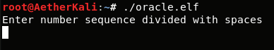 

Хм, от нас хотят какую-то числовую последовательность, попробуем ввести: 

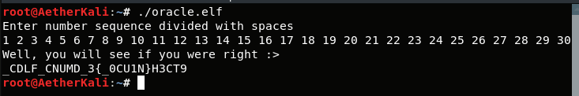 

Это похоже на флаг (есть фигурные скобки, какой-то текст), но с ним что-то не так. Пора ревёрсить! 
С помощью IDA открываем файл, в меню слева выбираем функцию main и можно сразу нажать F5 чтобы смотреть на псевдокод, а не ассемблер: 

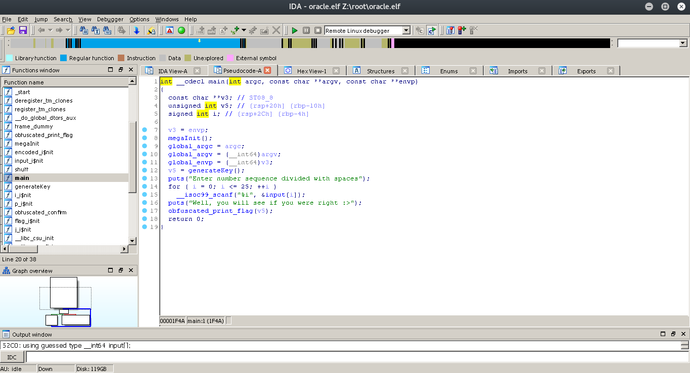 

Что собственно происходит: 
* выполняется функция generateKey() 
* принимается ввод от пользователя 
* выполняется функция obfuscated_print_flag() 

Посмотрим на функцию obfuscated_print_flag(): 

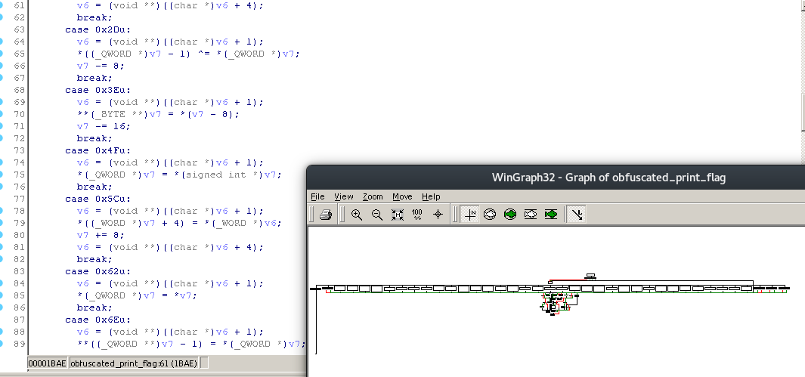 

Какая-то обфусцированная жесть, пожалуй мы не будем сюда долго смотреть. 
 
А вот функция genKey() нам уже более понятна и интересна: 

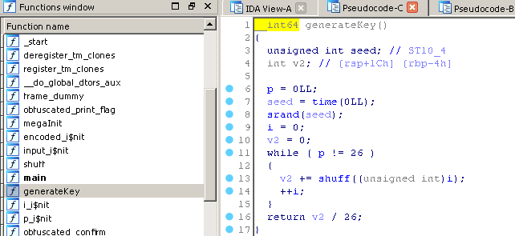 

В ней 26 раз выполняется функция shuff(), наверное стоит и в неё глянуть: 

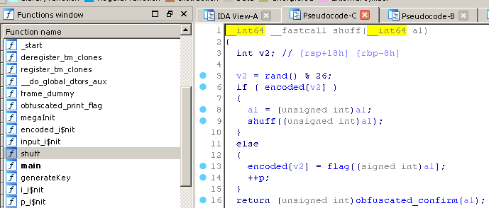 

Вот тут нас и ожидает самое интересное - генерируется случайное число и делится по модулю на 26, далее проверяется есть ли элемент с таким индексом в массиве encoded, и если есть - всё повторяется заново рекурсивным вызовом функции shuff(), если же такого элемента нет, по этому индексу записывается значение из массива flag по индексу a1, в нашем случае a1 - счётчик. 

Можно бы было попробовать посмотреть на массив flag, но его элементы зашифрованы. 
Теперь, когда мы знаем что функция generateKey() на самом деле случайным образом переставляет элементы массива flag и записывает их в encoded, можно поставить breakpoint на удачную генерацию индекса массива encoded: 

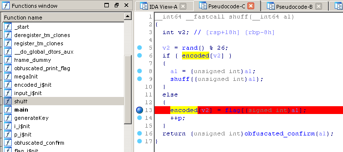 

...запустить дебаг сервер IDA: 

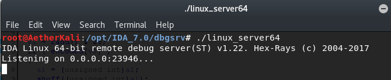 

...и подключиться к нему: 

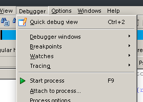 

В дебаггере мы сразу оказываемся на breakpoint'e и можем посмотреть значение индекса (v2, оно же хранится в регистре RCX) 

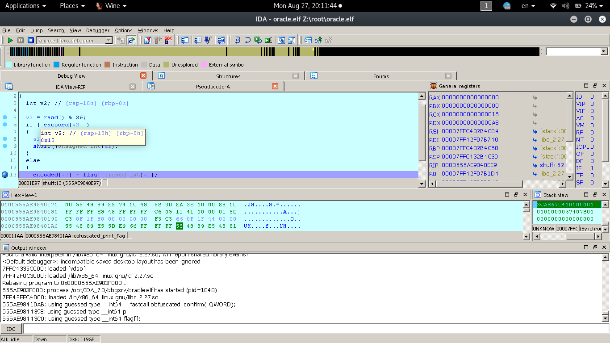 

Далее мы записываем значение индекса и продолжаем работу программы (повторять ещё 25 раз, после чего программа перестанет останавливаться на breakpoint'e) 

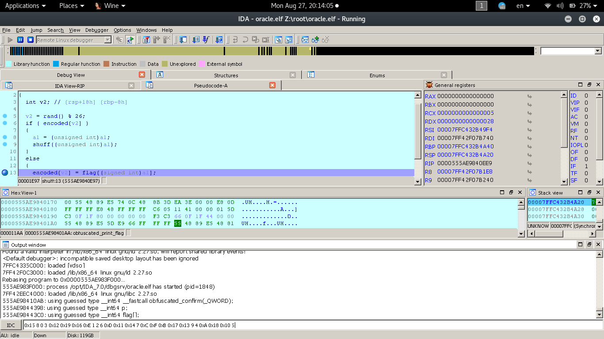 

Копируем записанные значения и вставляем в программу: 

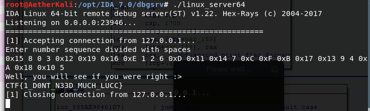 

Получаем флаг: 
> CTF{1_D0NT_N33D_MUCH_LUCC}
